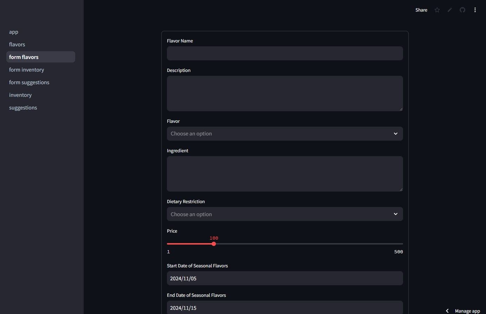
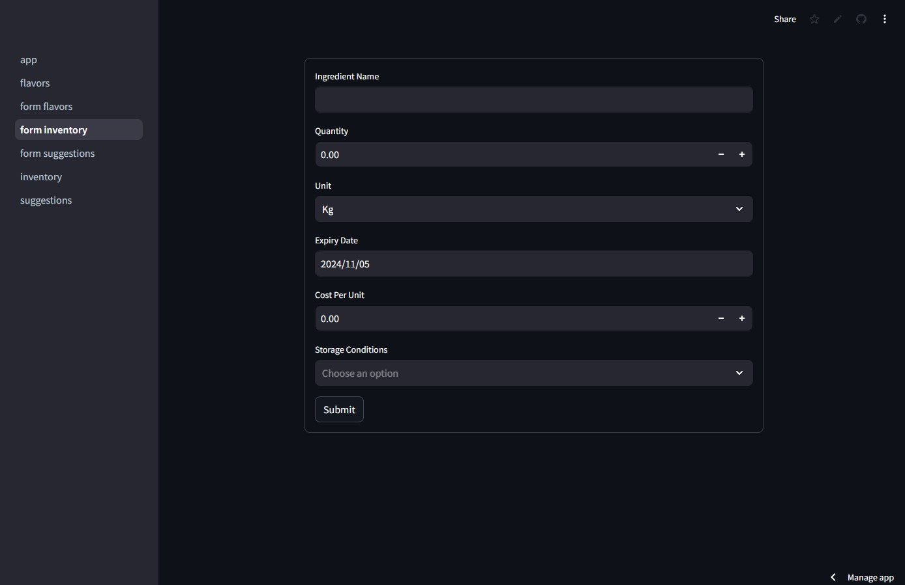
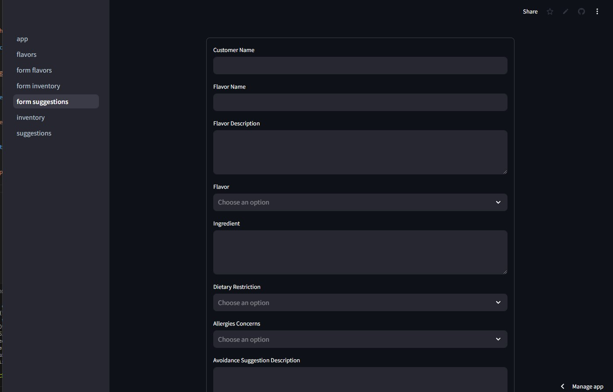
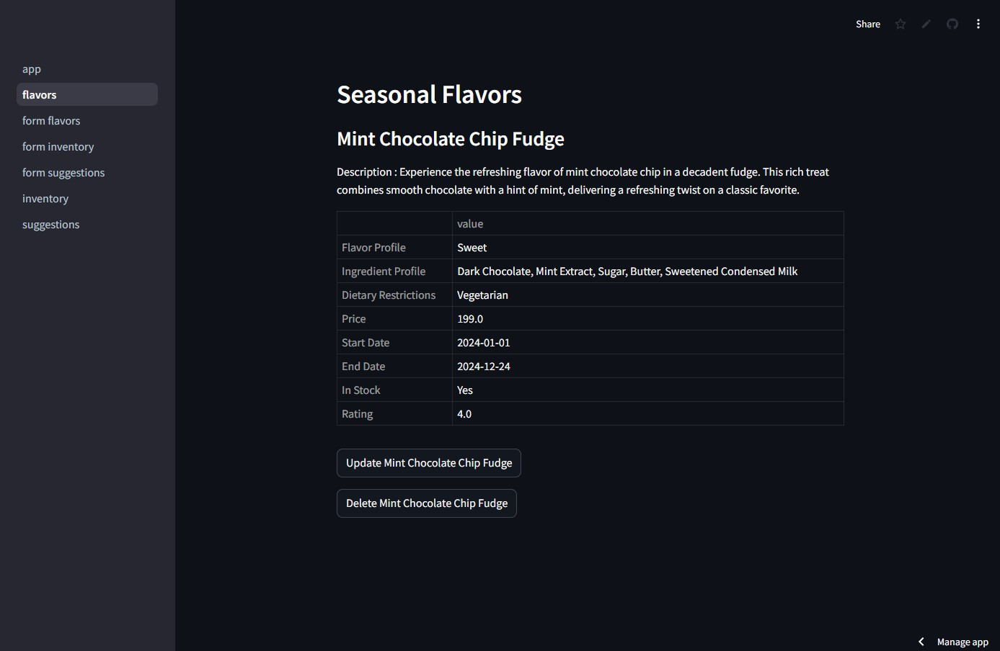
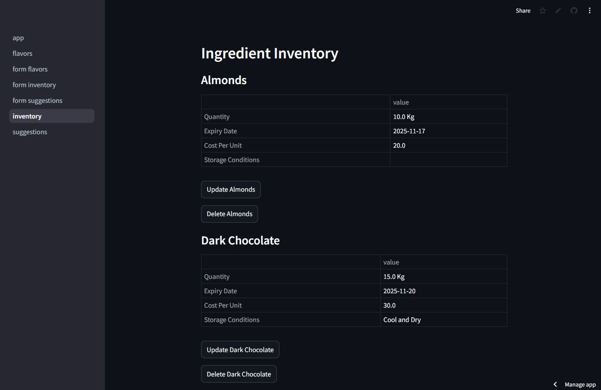
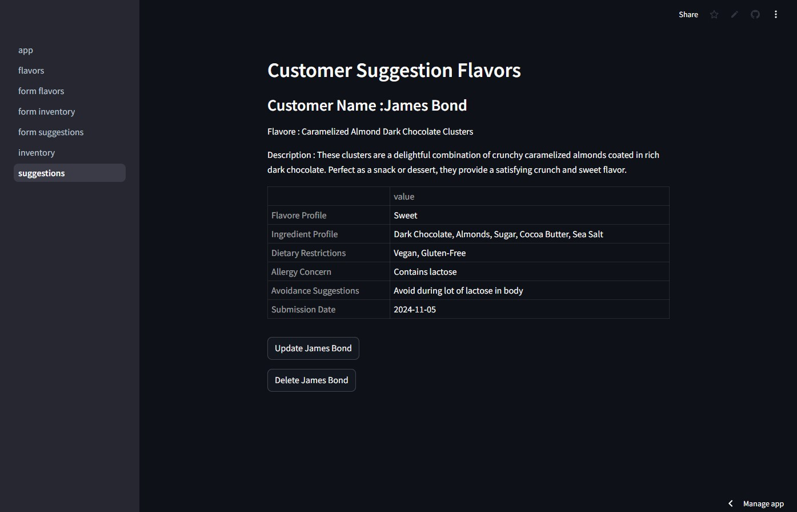

# Chocolate_house

Deploy Application Link [Open Streamlit](https://chocolate-house-punithsl.streamlit.app/)

Github : [open Github](https://github.com/PunithSL/Chocolate_house)

## Clone the application

```bash
git clone https://github.com/PunithSL/Chocolate_house.git
```

### Install Requirement

```bash
pip install requirements.txt
```

### TO Run Application

```bash
streamlit run app.py
```

## Images of Application

### Seasonal Flavors Form



### Inventory Form



### Customer Suggestions Form



### Seasonal Flavors



### Inventory



### Customer Suggestion


